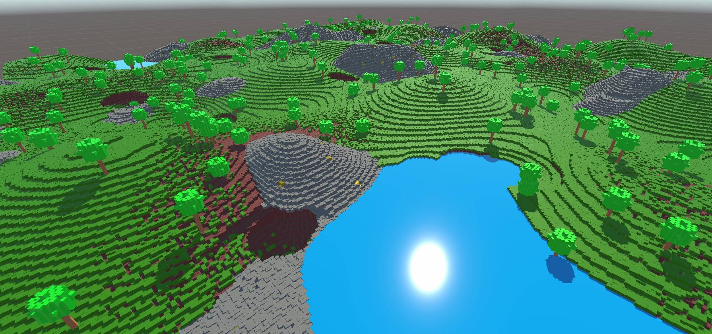

# Unity C# MineCraftish terrain generation

Example of generated 256 x 256 x 64 terrain

Example of generated 128 x 128 x 64 terrain

Example of generated 512 x 512 x 64 terrain

TerrainGenerator.cs script as seen in Unity Editor.

This is the most complex terrain generator I could get with a single API request from gpt-4-0314 (included one system "primer" and one user prompt).

##GPT4 prompts that generated this terrain generation code

##Prerequisites

The TerrainGenerator.cs was tested to work with Unity 2021.3.18f1 with the Entities and Hybrid Renderer packages installed (both at version 0.51.1-preview.21), as well as Universal RP package (version 12.1.10). If you use this script with a different Entities package version, you probably need to modify the CreateCube()-method within errainGenerator.cs, because the Entities API seems to be in a constant flux.
