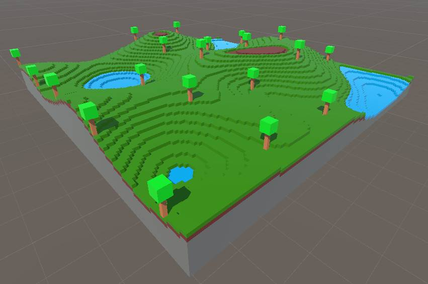

# MineCraftish terrain generation Unity script by GPT4 (and a bug-fixing human)

Example of generated 256 x 256 x 64 terrain:


Example of generated 128 x 128 x 64 terrain:


Example of generated 512 x 512 x 64 terrain:


TerrainGenerator.cs script as seen in Unity Editor.


## 1st attempt: Trying to create the terrain generation code with a single GPT4 prompt

My initial attempt was the result of me playing with OpenAI's API via their Python library. To my disappointment it was challenging to get GPT4 to spit out complete code examples. Instead, it mostly wanted to give templates for me to fill, even though we were not even close to breaking the max token limit.

Below is the most complex terrain generator script for Unity, which I could get with a single API request from gpt-4-0314 (included one system "primer" and one user prompt).


The aforementioned single API request was the following (it included the typo "terraing"):

``` python
response = openai.ChatCompletion.create(
  model="gpt-4",
  messages=[
        {"role": "system", "content": "You are a game code repository containing final source code for a full game."},
        {"role": "user", "content": "Write a Unity C# script that uses ECS to generate a Minecraft-like terrain by creating basic cubes into a 128 x 128 x 64 grid with Perlin noise. The script should have material slots for different cube materials (dirt, rock, water, foliage, wood, leaves). The terraing generation should happen in two passes: In the first pass the basis of the terrain is created from dirt and rock materials. The second pass adds the remaining materials (small lakes made of water material, foliage material to cover most of the top-level dirt, and trees made of wood and leaves materials). This file should contain at least 16000 characters, so that the terrain generation will be as extensive as possible."}
    ],
  max_tokens=7900,
  temperature=0.0      
)
```

The result is decent, but there are some flaws like the water not pooling properly, the trees being placed evenly in a lattice formation, and no rock pushing through the dirt and foliage. To get the script working, I had to modify the entity creation in a few places of the script. This was because the Unity Entities API has been changing a lot, and the version I used wasn't compatible with the entity creation code that I received from GPT4, which is quite understandable.

## 2nd attempt: Creating the terrain generation code through a dialogue with ChatGPT

At this point it seemed impossible to sweet talk GPT to give me a full working code with a single prompt, so I decided to get it in pieces from ChatGPT Plus (which uses GPT4 model as far as I know). First it gave me a template for a somewhat involved 3-phased terrain generation algorithm that I requested, with empty methods for each phase. Then I asked ChatGPT to fill in the empty methods, spending one prompt for each method.

Here's my initial prompt that started the dialogue:

> Write a Unity C# script that uses ECS to generate a Minecraft-like terrain by instantiating basic cubes into a 128 x 128 x 64 grid with Perlin noise. The script should have material slots for different cube materials (dirt, rock, water, gold, foliage, wood, leaves). The terrain generation should happen in three passes: 1) In the first pass the basis of the terrain is created from dirt, rock, and water materials. 2) The second pass uses Perlin worms to carve away some of the existing terrain to form caves, ravines, and canyons. 3) The third pass adds the remaining materials (gold material under ground, foliage material to cover most of the top-level dirt, and trees made of wood and leaves materials).

Below you can see the terrain that I got from the resulting algorithm (after switching to the correct entity creation procedure for the Unity Entities API version I was using):


As you can see, all the basic elements are there, but it's very wonky. I asked ChatGPT to rewrite the 1st method to properly place the foliage, and the 3rd method to make the water behave like liquid, using point sources and 6-connected flood fill. Finally, I also asked ChatGPT to make the tree creation a bit more elaborate, requesting spherical tree foliage among other things. There were a few bugs in ChatGPT's code that I needed to fix, such as using FloorToInt in places where RoundToInt was required, and flood fill continuing beyond the voxel grid boundaries. I did slightly improve the code for things like exposing some of the script's private parameters to Unity's inspector, and adding my own hacks (particularly with the Perlin worms).

[You can view my full dialogue with ChatGPT Plus here.](chat-gpt-unity-terrain-generation-with-ecs.md)

## Prerequisites

The TerrainGenerator.cs was tested to work with Unity 2021.3.18f1 with the Entities and Hybrid Renderer packages installed (both at version 0.51.1-preview.21), as well as Universal RP package (version 12.1.10). If you use this script with a different Entities package version, you probably need to modify the CreateCube()-method within TerrainGenerator.cs, because the Entities API seems to be in a constant flux.

Please note that the script is not "production ready". This was the first time I played around with Unity's Entity Component System, and there are several avenues for optimization, for example using multiple parallel threads to piece together the terrain. It takes around 10 minutes for my 2018 laptop to produce a 512 x 512 x 64 map, depending on the number of perlin worms and water sources.
